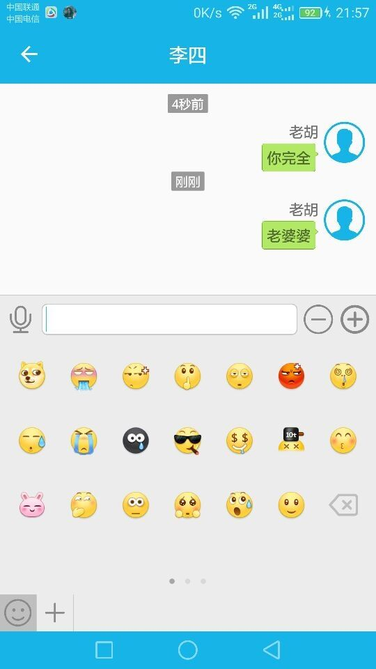
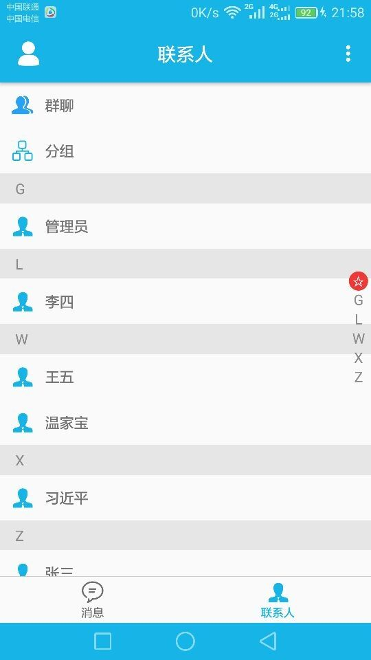

# TigerIM
基于Openfire+Smack实现的简单即时通信客户端，界面仿照QQ实现。
实现了简单的登陆、注册、点对点聊天，发送文本、语音、图片消息，同时程序中实现了多人之间的聊天，但是没写界面，后面有时间之后再完善吧。
目前程序完全可以独立运行，程序里面配置了服务器。

Smack与openfire服务之间的通信关键代码和实现可以参考我的[博客文章](http://ittiger.cn/tags/smack/)

# 实现效果如如下：

